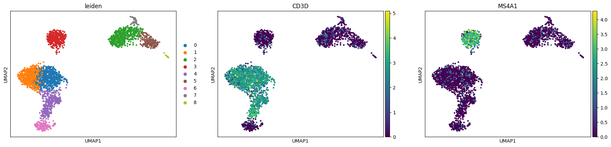

# Single-Cell RNA-seq QC & Clustering Pipeline (PBMC 3k)

## Overview
This repository demonstrates a primary single-cell RNA-sequencing (scRNA-seq) processing workflow on human PBMC data using **Scanpy**. 
It highlights essential data processing steps including quality control (QC), normalization, dimensionality reduction, and marker-based cell-type identification.

## Key Pipeline Steps
1. **Data Loading:** Loaded 10x Genomics PBMC 3k dataset.
2. **Quality Control (QC):** Filtered low-quality cells based on gene counts and mitochondrial read percentage (`pct_counts_mt < 5%`).
3. **Normalization & HVG Selection:** Log-normalized expression counts and identified highly variable genes.
4. **Clustering & Visualization:** Constructed k-NN graphs, performed Leiden clustering, and generated UMAP plots.

## Results: Cell Type Identification

- **CD3D (T-cell Marker):** Specifically expressed in the primary lower T-cell clusters, identifying the main T-cell population.
- **MS4A1 (B-cell / CD20 Marker):** Confirmed high expression specifically in the distinct upper-left cluster, identifying the B-cell population.

## Tech Stack
- **Language:** Python 3.12.13
- **Core Packages:** Scanpy, AnnData, Matplotlib, Seaborn, Leidenalg
